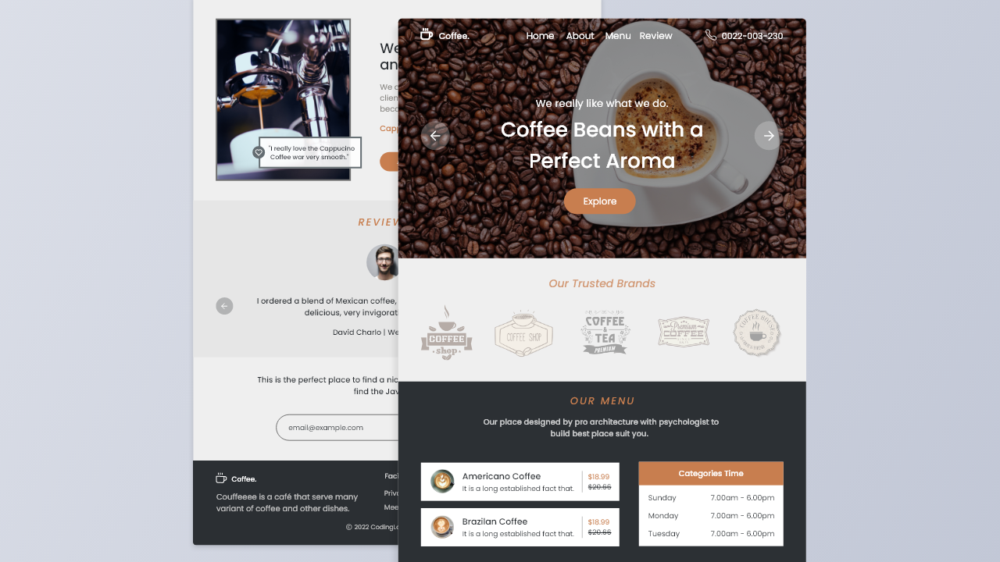

  

<h1 align="center">
  Coffee Shop Website
</h1>

<h3 align="center">
  A Fusion of Design, Functionality, and User Experience
</h3>

  

### Introduction:

The Coffee Shop Website is an exceptional online platform that has been meticulously designed and developed to showcase a coffee shop's offerings, attract customers, and enhance their overall experience. This project brings together the power of HTML, CSS, JavaScript, the Swiper bundle, and the ScrollReveal animation library to create a visually captivating and user-friendly website.

### Project Overview:

The Coffee Shop Website is built upon a solid foundation of HTML, which provides the structure and content of the web pages. The CSS styling adds aesthetic appeal, ensuring a visually pleasing and engaging user interface. JavaScript brings interactivity and functionality to the website, while the Swiper bundle and ScrollReveal animation library offer seamless and dynamic page transitions and captivating animations, respectively.

### Design and Layout:

The Coffee Shop Website boasts a modern and eye-catching design that reflects the essence of a coffee shop. The layout is carefully planned to provide a smooth and intuitive navigation experience, allowing users to effortlessly explore various sections of the website.

### Homepage:

The homepage serves as the gateway to the coffee shop's online presence. It features an inviting hero section with a high-resolution image or video backdrop, accompanied by a concise and impactful tagline that instantly communicates the coffee shop's unique selling proposition. The hero section may also include a call-to-action button to entice users to explore further.

### Menu Section:

The menu section is designed to highlight the wide array of beverages and food items offered by the coffee shop. It is structured in a visually appealing manner, with enticing images and descriptions of each item. Users can easily browse through the menu categories, such as coffees, teas, pastries, sandwiches, and more, to find their desired choices.

### Online Ordering and Reservation:

To enhance user convenience, the Coffee Shop Website incorporates an online ordering and reservation system. Customers can easily place orders for pickup or delivery, specify customization options, and select desired pick-up or delivery times. Additionally, a reservation form enables users to book a table or a private event at the coffee shop, ensuring a seamless experience for both customers and the coffee shop's staff.

### Events and Specials:

The website provides a dedicated section to promote upcoming events, seasonal specials, and limited-time offers. This section allows users to stay informed about any coffee tastings, live performances, or promotional discounts, thereby creating a sense of excitement and encouraging repeat visits.

### Location and Contact Information:

A well-designed contact page offers essential information, including the coffee shop's physical address, contact numbers, and operating hours. This section may also include an embedded Google Map for easy navigation. Additionally, a contact form enables users to send inquiries, feedback, or reservation requests directly to the coffee shop's staff.

### Responsive Design:

The Coffee Shop Website is fully responsive, ensuring a seamless user experience across various devices, such as desktops, laptops, tablets, and smartphones. The design automatically adapts to different screen sizes, maintaining the website's visual appeal and functionality regardless of the user's device.

### Conclusion:

The Coffee Shop Website is a testament to the successful integration of HTML, CSS, JavaScript, the Swiper bundle, and the ScrollReveal animation library. Its visually captivating design, user-friendly interface, and seamless functionality combine to provide an exceptional online experience for coffee lovers and potential customers. By showcasing the coffee shop's menu, online ordering and reservation system, events and specials, and contact information, this website serves as a powerful tool for attracting and engaging customers, ultimately boosting the coffee shop's online presence and success.

  
<!-- ................................................................................................................................. -->

### Demo

  The Demo of this working project can be found on  
  <a href="https://rebrand.ly/CoffeeShop_MABCORP">rebrand.ly/CoffeeShop_MABCORP</a>

  
<!-- ................................................................................................................................. -->

### Website Preview   

  
<!-- ................................................................................................................................. -->

### Technology Stack
 
Follwing technologies have been used at the core of this application to make it stand in the market place:

- HTML
- CSS
- JS
- SwiperBundle
- ScrollReveal

  
<!-- ................................................................................................................................. -->

### Advancement

> Nothing Yet

  
<!-- ................................................................................................................................. -->

### Deployment Details

The website is deployed using the free hosting provided by **Vercel**

  

  
Later on the link was customized using the well-known URL shortener and customizer **Rebrandly**:  

  

  
<!-- ................................................................................................................................. -->

### Developer

Muhammad Abdullah Butt  
abdullahbutt12292210@gmail.com  
> [Instagram](https://www.instagram.com/abdullah.butt.22/) 
> [FaceBook](https://www.facebook.com/profile.php?id=100076291614529) 
> [YouTube](https://www.youtube.com/channel/UCnuOFQyMywg-KuoN-lmav1Q) 
> [Portfolio](https://rebrand.ly/MuhammadAbdullahButt_MABCORP) 
> [Project Displayer]( https://rebrand.ly/ProjectDisplayer_MABCORP)
  
<!-- ................................................................................................................................. -->

